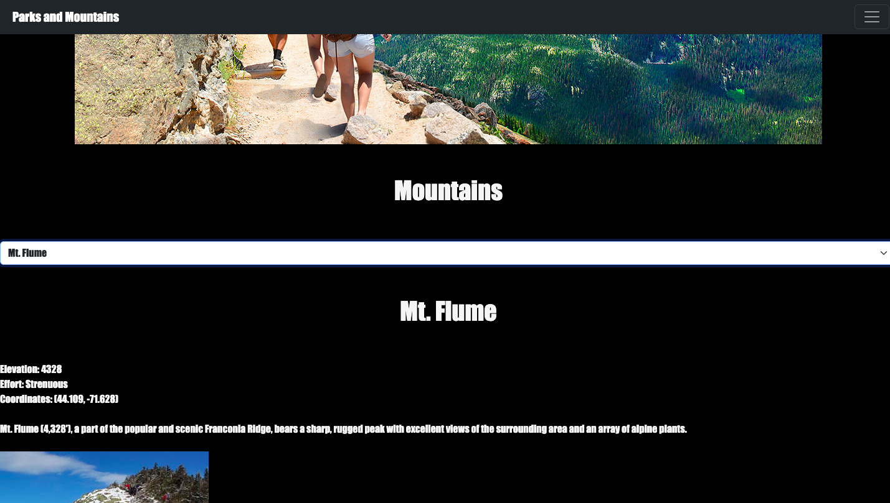
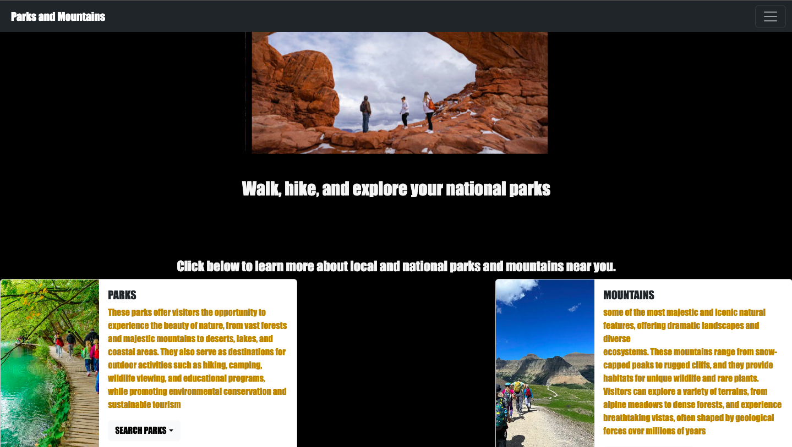

## PARKS & MOUNTAINS

Mountain page gives information on mountains across the country. Gives info on elevation, coordinates, and a brief description about the mountain and effort needed to climb.
## MOUNTAIN INFO PAGE

home page includes bootstrap carousel and cards, navigation bar, and links to other existing pages.
## home page

Parks page has functional filter button and added bootstrap cards for clealry displaying info. Addition of bootstrap is a piece of unique code I added
## PARKS PAGE

navigation bar added using bootstrap
## NAVI BAR

## JavaScript code snippet
updated function used to create bootsrap cards around park info

